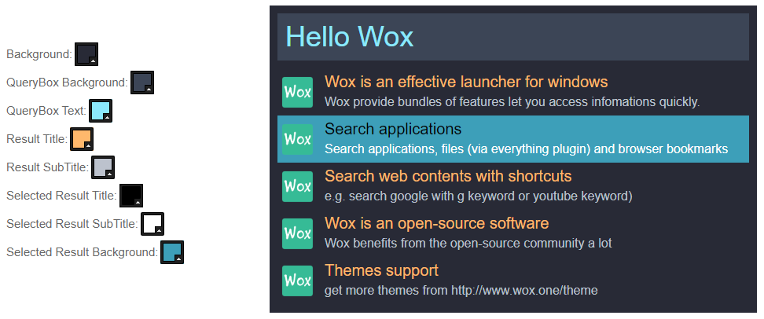

# Non-official Dracula theme for [Wox](https://github.com/Wox-launcher/Wox)

> A dark theme for [Wox](https://github.com/Wox-launcher/Wox) with `Dracula Blue and Orange`. \
>If you want `official` Dracula theme badly, you can find it out [here](https://draculatheme.com/wox/).

## Install

### Install using Git
If you are a git user, you can install the theme and keep up to date by cloning the repo:

    $ git clone https://github.com/tooilxui/wox-theme.git

### Install manually
Download using the [`GitHub .zip download`](https://github.com/tooilxui/wox-theme/archive/master.zip) option and unzip them.

Activating theme
Move `DraculaBlueOrange.xaml` to `Wox\Themes\` (usually under %USERPROFILE%\AppData\Local\)
Open up Wox by running it or hitting your global hotkey
Type `settings` and run `Settings, Tweak this app`
Go to the `Theme` tab and select `DraculaBlueOrange` and exit out of settings
Your theme is now applied.